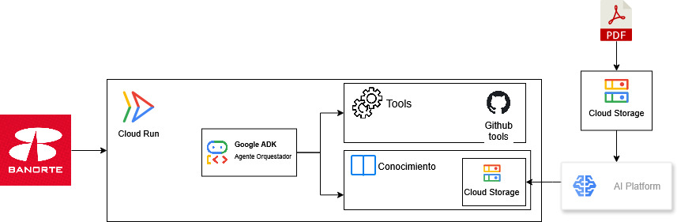

# Agente de CV — Carlos Alfonso Alberto Salazar

Agente conversacional que representa el perfil profesional de Carlos Alfonso Alberto Salazar. Responde preguntas sobre su experiencia, habilidades, proyectos y hackathones mediante una conversación natural en español, con acceso en tiempo real a su actividad en GitHub.

Desarrollado para el **Reto IA Banorte**.

---

## Demo

**Endpoint público (Open Responses API):**
```
https://cv-agent-512646778802.us-central1.run.app
```

```bash
curl -X POST https://cv-agent-512646778802.us-central1.run.app/ \
  -H "Content-Type: application/json" \
  -H "Authorization: Bearer <API_KEY>" \
  -d '{"input": "¿Cuál es tu experiencia en Machine Learning?"}'
```

---

## Arquitectura



El sistema tiene dos partes independientes:

### Pipeline (procesamiento del CV)
```
PDF → Cloud Storage → Gemini (Vertex AI) → JSON estructurado → Cloud Storage
```
Transforma cualquier CV en PDF a un JSON estructurado con campos estándar. Se ejecuta una vez por CV y genera el conocimiento base del agente.

### Agente (conversación)
```
Pregunta → Cloud Run → FastAPI → Google ADK → Gemini
                                      ├── Contexto: JSON del CV (Cloud Storage)
                                      └── Tools: GitHub API (tiempo real)
```
Recibe preguntas, las responde usando el JSON como contexto y consulta GitHub cuando el usuario pregunta por proyectos específicos.

---

## Decisiones técnicas clave

**¿Por qué JSON y no PDF directo al agente?**
Un CV cabe completo en el contexto de Gemini (~3,000-6,000 tokens). Procesarlo una sola vez con el pipeline y guardarlo como JSON elimina latencia y ambigüedad de formato en cada conversación.

**¿Por qué un solo agente y no multi-agente?**
Se evaluó un agente Guardian para seguridad, pero el dato protegido es público (un CV). La validación de inputs en código y las instrucciones del system prompt son suficientes para este caso.

**¿Por qué tools para GitHub y no base de conocimiento?**
Los datos del CV son estáticos → JSON en contexto. Los datos de GitHub son dinámicos (repos, READMEs cambian) → tools en tiempo real. Cada tipo de dato se maneja con la herramienta adecuada.

**¿Por qué Cloud Run?**
Serverless, escala a cero, deploy desde código fuente en un solo comando. Sin gestión de infraestructura.

**Modelo configurable por variable de entorno**
`GEMINI_MODEL` permite cambiar el modelo sin tocar código ni hacer redeploy de la lógica.

---

## Estructura del proyecto

```
├── pipeline/               # Procesamiento PDF → JSON
│   ├── extractor.py        # Extrae texto del PDF (PyMuPDF)
│   ├── structurer.py       # Estructura el JSON con Gemini
│   ├── storage.py          # Lectura/escritura en Cloud Storage
│   ├── main.py             # Entry point (CLI local o servidor HTTP)
│   └── requirements.txt
│
├── agent/                  # Agente conversacional
│   ├── agent.py            # Factory del Agent de Google ADK
│   ├── cv_loader.py        # Carga el JSON del CV
│   ├── prompts.py          # System prompt con CV y fecha inyectados
│   ├── tools/
│   │   └── github.py       # Tools: list_repos, get_details, get_readme
│   └── requirements.txt
│
├── api/
│   └── main.py             # Endpoint Open Responses (FastAPI)
│
├── documentation/
│   ├── pipeline/           # Docs del pipeline
│   ├── agent/              # Docs del agente
│   └── deploy/             # Guía de deploy y operación
│
├── Dockerfile              # Imagen del agente para Cloud Run
├── test_agent.py           # Script de prueba local interactivo
├── .env.example            # Variables de entorno requeridas
└── requirements.txt        # Dependencias completas (desarrollo local)
```

---

## Correr en local

### Prerrequisitos

```bash
pip install -r requirements.txt
gcloud auth application-default login
gcloud services enable aiplatform.googleapis.com --project=TU_PROJECT_ID
```

Copia `.env.example` a `.env` y completa los valores.

### Procesar un CV

```bash
python -m pipeline.main --pdf tu_cv.pdf --output cv.json
```

### Probar el agente (modo interactivo)

```bash
python test_agent.py
```

### Correr el endpoint HTTP

```bash
python -m api.main
# Disponible en http://localhost:8081
```

---

## Deploy en Cloud Run

Guía completa en [`documentation/deploy/README.md`](documentation/deploy/README.md).

```bash
gcloud run deploy cv-agent \
  --source . \
  --region us-central1 \
  --allow-unauthenticated \
  --set-env-vars "GOOGLE_CLOUD_PROJECT=...,GEMINI_MODEL=gemini-2.5-flash,..." \
  --project=TU_PROJECT_ID
```

---

## Variables de entorno

Ver [`.env.example`](.env.example) para la lista completa. Las principales:

| Variable | Descripción |
|---|---|
| `GOOGLE_CLOUD_PROJECT` | ID del proyecto de Google Cloud |
| `GEMINI_MODEL` | Modelo de Gemini (default: `gemini-2.5-flash`) |
| `GOOGLE_GENAI_USE_VERTEXAI` | `true` para usar Vertex AI con ADC |
| `OUTPUT_BUCKET` | Bucket de Cloud Storage con el JSON del CV |
| `GITHUB_USERNAME` | Fallback si el CV no tiene URL de GitHub |
| `AGENT_API_KEY` | API key para proteger el endpoint |

---

## Documentación detallada

- [Pipeline](documentation/pipeline/README.md) — procesamiento de CV, schema JSON, decisiones técnicas
- [Agente](documentation/agent/README.md) — arquitectura del agente, system prompt, tools de GitHub
- [Deploy](documentation/deploy/README.md) — guía completa de despliegue, rollback y operación

---

## Stack

| Capa | Tecnología |
|---|---|
| Modelo | Gemini 2.5 Flash (Vertex AI) |
| Framework de agente | Google ADK |
| API | FastAPI + uvicorn |
| Extracción de PDF | PyMuPDF |
| Deploy | Google Cloud Run |
| Almacenamiento | Google Cloud Storage |
| Datos dinámicos | GitHub REST API |
